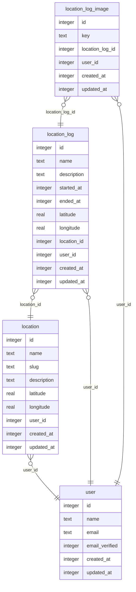

Example schema (you will add the user table and user*id columns \_after* adding the auth schema later):

- [ ] Database schema is defined
- [ ] Migration system is configured
- [ ] Database is created / migrated locally (not in the cloud)
- [ ] Database connection is properly configured
- [ ] Environment variables are documented
